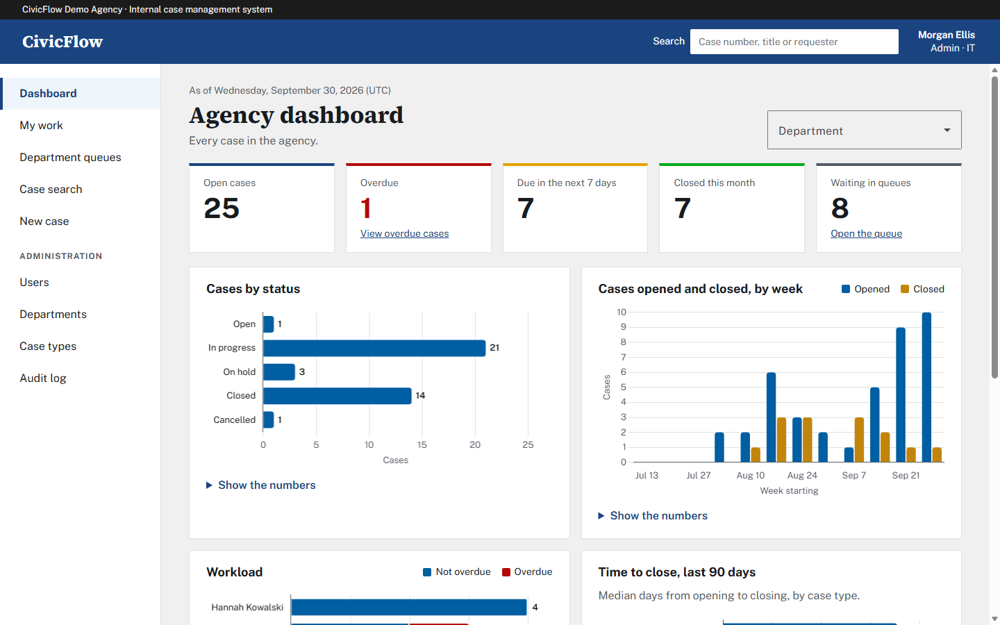
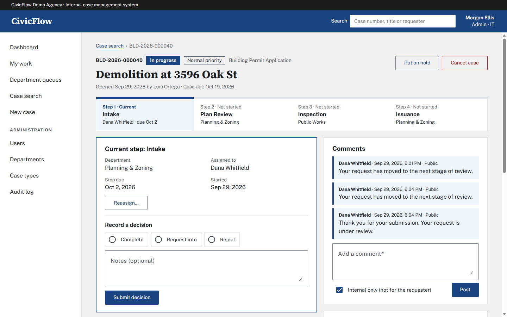
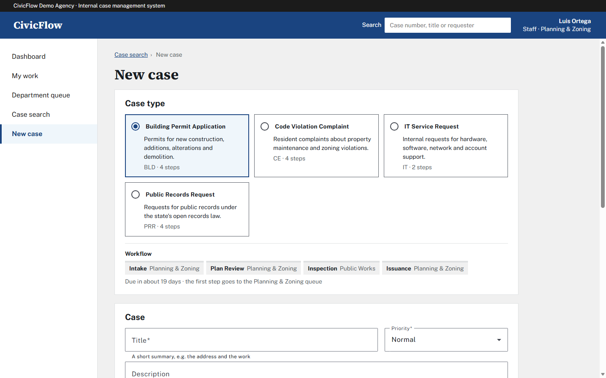
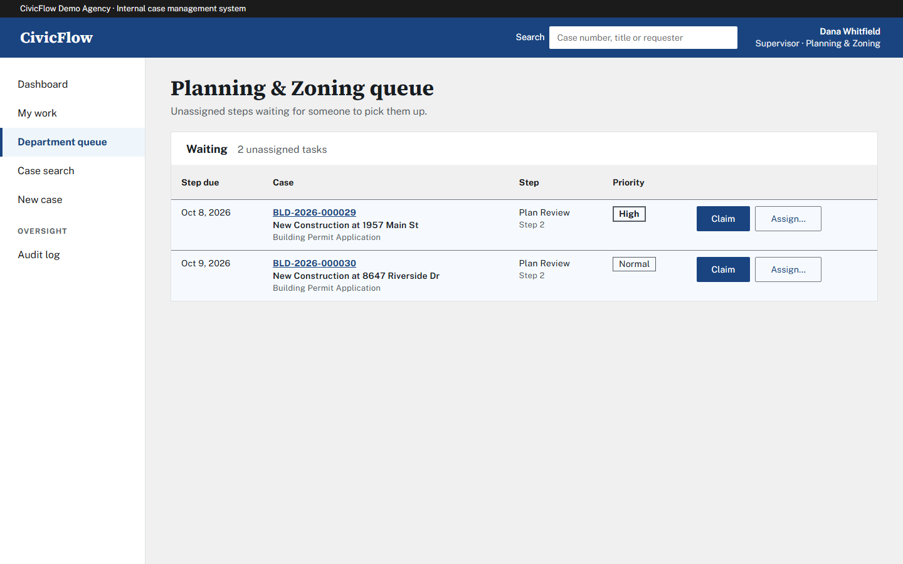
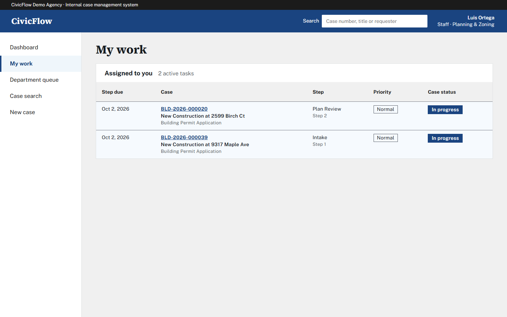
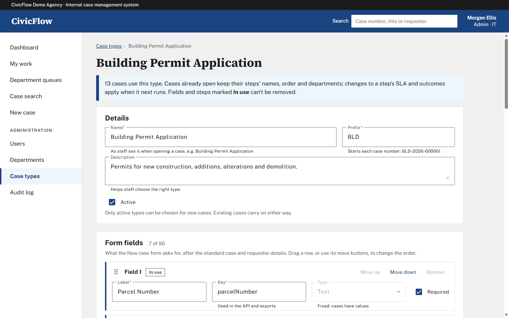
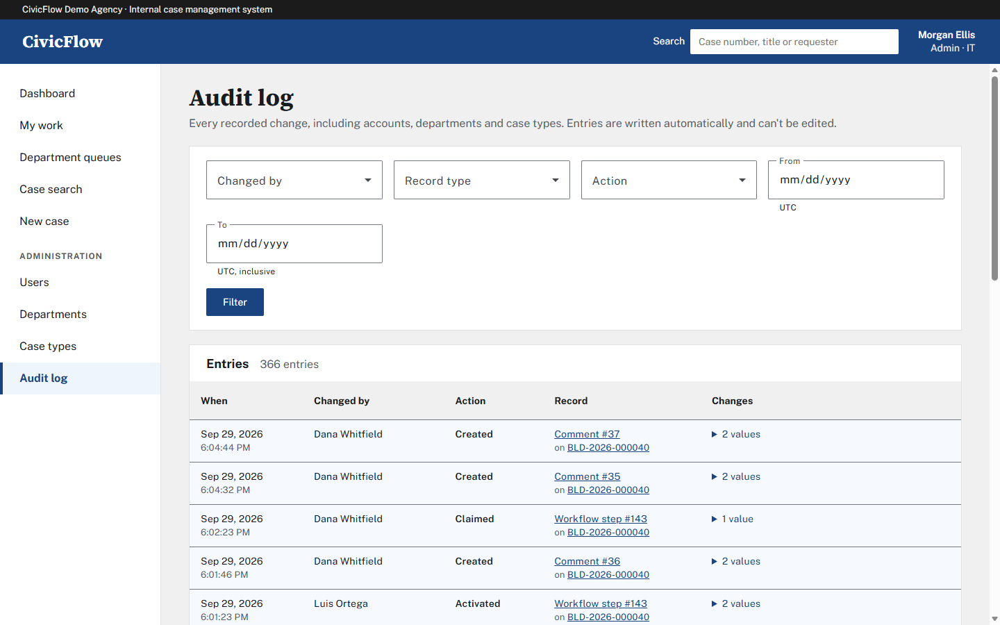
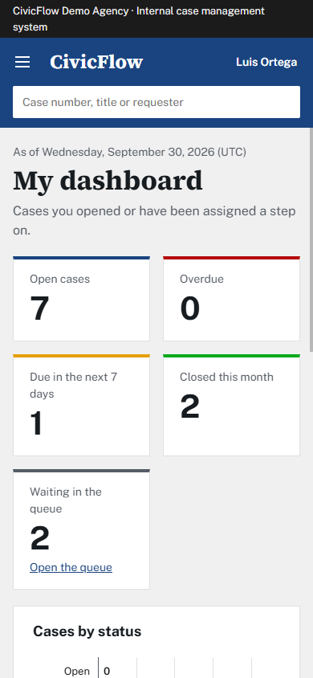

# CivicFlow

A case and workflow management system modelled on the platforms government agencies use to track permits, complaints, records requests and service tickets. Administrators define case types with custom form fields and multi-step workflows. Cases move through department queues with role-based access, SLA tracking, and a full audit trail.



## Features

- **Configurable case types.** Admins design each type's form fields and ordered workflow steps in the browser, with drag-and-drop or keyboard reordering. No code changes are needed to add a new kind of work.
- **Workflow engine.** Steps route to department queues with SLA due dates. Staff claim work and record decisions: approve, complete, return, reject or request info. Supervisors assign, hold, cancel and reopen.
- **Role-based access.** Admin, Supervisor and Staff roles, with department scoping, enforced by the API. See the [permission matrix](docs/permissions.md).
- **Audit trail.** Every change is recorded automatically with old and new values, in the same transaction as the change. Each case shows its own history, and supervisors and admins can search the whole log.
- **Collaboration.** Internal or public comments, and file attachments with size and type limits.
- **Dashboards.** Open, overdue, due-soon and closed counts, cases by status, weekly volume, staff workload and time to close, scoped to the viewer's role.
- **Accessibility.** Built to WCAG 2.1 AA and Section 508: labelled controls, error summaries, full keyboard use, visible focus, reduced-motion and high-contrast support, and data tables behind every chart.

## Tech stack

| Layer | Technology |
|---|---|
| Frontend | Angular 22 (standalone components, signals, zoneless), Angular Material, Chart.js |
| Backend | ASP.NET Core Web API (.NET 10), EF Core 10, FluentValidation |
| Database | SQL Server (LocalDB for development) |
| Auth | JWT bearer tokens, policy-based and resource-based authorization |
| Tests | xUnit unit and `WebApplicationFactory` integration tests (202), Vitest component and unit tests (176) |
| CI | GitHub Actions: backend against a SQL Server container, frontend build and tests |

## Documentation

- [Architecture](docs/architecture.md): layers, the workflow state machine, the audit trail and accessibility
- [Data model](docs/erd.md): entity-relationship diagram and schema notes
- [Roles and permissions](docs/permissions.md): the permission matrix and how the API enforces it

## Repository layout

```
backend/              ASP.NET Core solution
  src/CivicFlow.Domain/          entities and enums
  src/CivicFlow.Application/     services, workflow engine, permissions, validators
  src/CivicFlow.Infrastructure/  EF Core, migrations, seed data, audit interceptor, JWT, file storage
  src/CivicFlow.Api/             controllers, auth policies, error handling
  tests/CivicFlow.Tests/         unit and integration tests
frontend/             Angular app
docs/                 architecture, ERD, permission matrix, screenshots
.github/workflows/    CI
```

## Getting started

### Prerequisites

- .NET 10 SDK
- Node.js 24 LTS
- SQL Server LocalDB (installed with SQL Server Express, or on its own)
- The `dotnet-ef` global tool: `dotnet tool install -g dotnet-ef`

### 1. Database and API

```bash
cd backend
dotnet ef database update -p src/CivicFlow.Infrastructure -s src/CivicFlow.Api
dotnet run --project src/CivicFlow.Api
```

The first command creates a database named `CivicFlow` on `(localdb)\MSSQLLocalDB` and loads the demo data. The connection string is in `src/CivicFlow.Api/appsettings.json`. In Development, `dotnet run` also applies any pending migrations on startup, so the first command is optional.

The API listens on http://localhost:5109. The demo data is only seeded into an empty database. To start over, run `dotnet ef database drop -p src/CivicFlow.Infrastructure -s src/CivicFlow.Api` and then update again.

### 2. Frontend

In a second terminal:

```bash
cd frontend
npm ci
npm start
```

Open http://localhost:4200 and sign in with one of the [demo accounts](#demo-accounts). The sign-in page lists them too, in development builds. The dev server proxies `/api` to the API on port 5109.

### Tests

```bash
cd backend && dotnet test
cd frontend && npx ng test --no-watch
```

The backend integration tests run the API in memory against a separate database, `CivicFlow_Tests`, which they drop and reseed on every run. They never touch `CivicFlow`. To point them at another SQL Server, set `CIVICFLOW_TEST_CONNECTION` to a full connection string; CI does this with a SQL Server container.

### Trying the API

With the API running, Swagger UI is at http://localhost:5109/swagger (Development only). Call `POST /api/auth/login` with a demo account, copy the `accessToken` from the response, and paste it into **Authorize**. Every endpoint except login and `/api/health` requires a token. Errors come back as [ProblemDetails](https://www.rfc-editor.org/rfc/rfc9457) JSON.

Only `appsettings.Development.json` contains a JWT signing key. In any other environment, set `Jwt__SigningKey` (at least 32 bytes) through user secrets or an environment variable, or the API refuses to start.

## Demo accounts

These accounts are seeded in Development only. All of them use the password `CivicFlow!2026`.

| Role | Email |
|---|---|
| Admin | `admin@civicflow.test` |
| Supervisor | `{dept}.supervisor@civicflow.test` |
| Staff | `{dept}.staff1@civicflow.test`, `{dept}.staff2@civicflow.test` |

The `{dept}` values are `pz` (Planning & Zoning), `ce` (Code Enforcement), `pw` (Public Works), `clk` (Clerk's Office) and `it` (IT). For example, `pz.staff1@civicflow.test` is a Planning & Zoning staff member.

The seed also creates four case types (Building Permit, Code Violation Complaint, Public Records Request and IT Service Request) and about 40 cases at varied stages: in department queues, assigned, overdue, on hold, closed and rejected.

### A quick walkthrough

1. Sign in as `pz.staff1@civicflow.test` and open a **New case** of type Building Permit Application. The form shows that type's custom fields.
2. Open **Department queue**, claim the new case's Intake step, and record **Complete**. The case moves on to Plan Review.
3. Sign in as `pz.supervisor@civicflow.test`, reassign a step from the case page, and watch the workload chart on the dashboard change.
4. Sign in as `admin@civicflow.test`, design a new case type under **Case types**, then create a case of that type.
5. Upload an attachment to a case and check its **History** timeline, or search everything in the **Audit log**.

## Screenshots

**Case detail:** the workflow stepper, the current step's decision panel and comments.



**New case:** choosing a type shows its workflow, then the form renders that type's custom fields.



**Department queue:** unassigned steps waiting to be claimed or assigned.



**My work:** steps assigned to the signed-in user, soonest due first.



**Case type designer:** fields and steps an admin can edit and reorder. Items used by existing cases are protected.



**Audit log:** every recorded change, filterable by person, record type, action and date.



**On a phone:** the navigation moves into a menu and the layout reflows to a single column.


