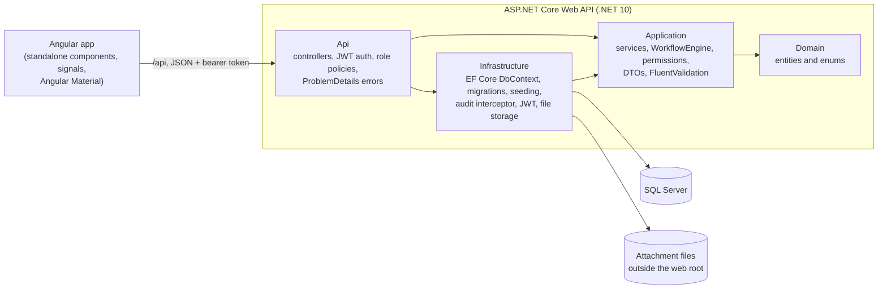
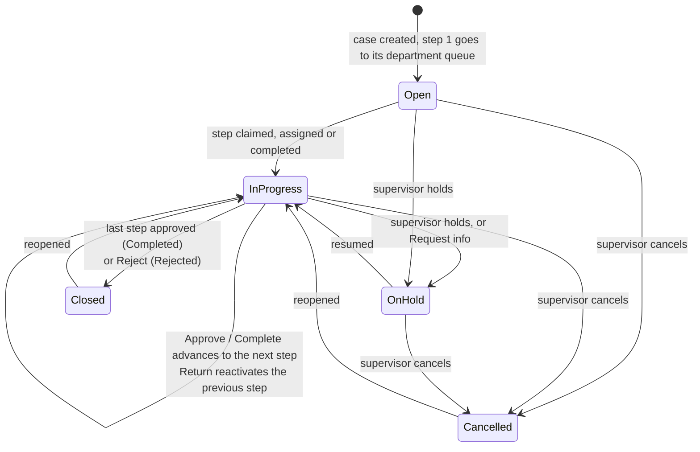

# Architecture

CivicFlow is an Angular single-page app in front of an ASP.NET Core Web API, backed by SQL Server.

## Backend layers

The solution (`backend/CivicFlow.sln`) follows a clean-architecture split. Dependencies point inward, and `ArchitectureTests` fails the build if a layer references one it shouldn't.

| Project | Responsibility | Depends on |
|---|---|---|
| `CivicFlow.Domain` | Entities (`Case`, `WorkflowTask`, `CaseType`…) and enums. No framework references. | nothing |
| `CivicFlow.Application` | Use cases: `CaseService`, `TaskService`, admin and dashboard services, the `WorkflowEngine`, `WorkflowPermissions`, request validators, DTOs. Talks to the database through `ICivicFlowDbContext`, and stays provider-neutral. | Domain |
| `CivicFlow.Infrastructure` | EF Core with SQL Server, migrations, the development seed, the audit interceptor, password hashing, JWT issuing, local file storage and the case number generator. | Application |
| `CivicFlow.Api` | Controllers, authentication and authorization setup, exception-to-ProblemDetails mapping, OpenAPI and Swagger UI. | Application, Infrastructure |

## Workflow engine

`Application/Workflow/WorkflowEngine` is a pure class: it changes a loaded case and its tasks in memory and never touches the database, so it is unit tested without one.

- **Creating a case** validates the custom fields against the case type, generates a number such as `BLD-2026-000042`, and creates one task per workflow step. Step 1 is active in its department's queue; the rest are pending. The case is due after the sum of the steps' SLA days.
- **Recording a decision:** *Approve* or *Complete* activates the next step, or closes the case after the last one. *Return* sends it back to whoever completed the previous step. *Reject* closes it as Rejected. *Request info* keeps the step active and puts the case on hold. Reject, Return and Request info require notes.
- **Reopening** a closed or cancelled case sends a new instance of the last step reached to its department queue.
- Invalid transitions return 409, and simultaneous edits of the same task are caught by its `rowversion` (also 409).

## Audit trail

An EF Core `SaveChangesInterceptor` records every insert, update and delete as an `AuditLog` row with old and new values, in the same transaction as the change. It turns property changes into meaningful actions, such as `Claimed`, `Approved`, `Returned` and `PutOnHold`. Password hashes are redacted and file storage paths are left out. Services don't write audit rows themselves, so a change can't skip the log.

## Frontend

`frontend/` is an Angular 22 app: standalone components, signals, zoneless change detection and strict templates.

- `core/` has the auth service (session in `sessionStorage`), the HTTP interceptor that adds the bearer token to `/api` calls, route guards, and one typed API service per area.
- `features/` has one folder per area: dashboard, cases (search, new, detail), tasks (my work, department queue), audit, and admin (users, departments, case type designer).
- `shared/` has reusable pieces such as the status chip, the assign dialog, the file uploader, the audit timeline and form error helpers.
- `layout/` has the app shell: agency banner, header search, role-aware navigation and skip link.
- The dev server proxies `/api` to the API on port 5109, so the API needs no CORS setup.

## Accessibility

The UI follows the U.S. Web Design System's look and targets WCAG 2.1 AA and Section 508:

- A skip link, landmarks and one `h1` per page. Focus moves to the main content on navigation, and to error summaries and notices when they appear.
- Every control has a visible label. Errors are listed in a summary that links to each field.
- Everything works from the keyboard, including reordering fields and steps in the case type designer (Move up / Move down, with live announcements), which otherwise relies on drag and drop.
- Status is never shown by colour alone, colours are chosen for AA contrast, and there is a 4 px focus ring.
- Charts have a text summary as their accessible name and a "Show the numbers" table.
- Respects `prefers-reduced-motion` and Windows high-contrast (`forced-colors`) mode.
