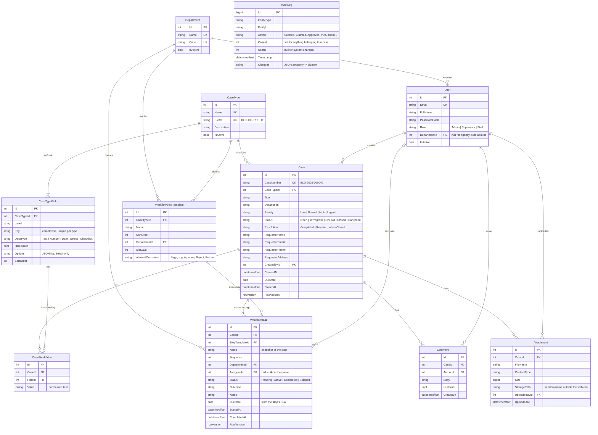

# Data model

CivicFlow stores everything in one SQL Server database. The schema is created by EF Core migrations in `backend/src/CivicFlow.Infrastructure/Persistence/Migrations`.

## Notes

- **Enums are stored as strings**, so the tables read clearly in SQL and in reports.
- **`AuditLog` has no foreign keys.** Audit rows must outlive anything they describe, so `CaseId` and `UserId` are plain columns. Rows are written by an EF Core `SaveChanges` interceptor in the same transaction as the change; nothing in the application writes them directly.
- **A workflow task is a step instance.** Returning a case to an earlier step, or reopening it, adds a new task for that step instead of rewinding the old one, so every decision keeps its outcome and notes. Several tasks can share a `Sequence`.
- **Tasks snapshot their step.** Name, order and department are copied when the task is created, so editing a case type doesn't rewrite the history of open cases.
- **Concurrency:** `Case` and `WorkflowTask` carry a `rowversion`. Two people acting on the same task at once get a 409 instead of overwriting each other.
- **Nothing is deleted.** Users, departments and case types are deactivated. A field or step that existing cases use can't be removed from its case type.
- **Attachments** are stored on disk under random names with only metadata in the database. The content type comes from the file extension, never from the client.
